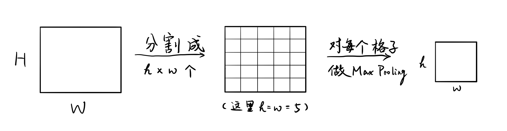

# `Fast `R-CNN``

这篇论文的作者是`R-CNN`的作者Ross Girshick，来自Microsoft Research，发表在2015年的ICCV上。

## 思路脉络

`R-CNN`太慢，对每个Proposal都要过一次CNN，而不是共享计算的结果。若结果不共享，需要保存每个proposal的视觉特征，存储、读取的开销大。除此之外还有几个细节的修改，使得`Fast R-CNN`的训练过程不再是`R-CNN`一样的多阶段。

和`R-CNN`一样，`Fast R-CNN`需要Selective Search提供Region Proposal。拿到Proposal以后并不是对每个Proposal进行CNN的视觉特征提取，而是对每张图片先过一个CNN，拿到一个Feature map（最后一个卷积层），再找到这张图片的每个Proposal对应在这个Feature map的区域，对这个区域进行RoI Pooling。这样处理能 1）对每个Proposal得到固定大小的特征；2）不重复计算每个Proposal的视觉特征。下面是RoI Pooling的过程：

得到了Proposal的特征之后，不同于`R-CNN`分为两步（训练SVM+训练Bounding Box Regressor），`Fast R-CNN`用一个网络来输出最后微调后的Bounding Box和类预测。方式是在这个Proposal的特征层后接一个神经网络，其最后一层有两个兄弟层，一个用于输出类预测，一个用于回归盒子的边框平移、放缩。

## 写作技巧

在实验部分的最开始像列Contribution一样列出主要的Results来支撑Introduction处的Contribution。
