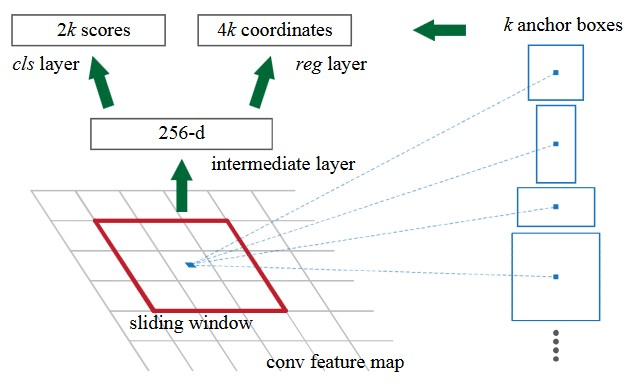

# Faster R-CNN

这篇文章是Shaoqing Ren, Kaiming He, Ross Girshick和Jian Sun发表在2015年的NIPS上的一篇论文。值得一提的是Ross Girshick是R-CNN和Fast R-CNN的作者。

## 思路脉络

`Fast R-CNN`的检测效率很高了，但是有个问题是Region Proposal生成的效率很低，如果用Selective Search生成的话，平均2秒才能生成一张图片的Proposal。因此作者提出用Region Proposal Network（RPN）来生成Proposal。思路是希望Proposal的生成也可以和卷积共享视觉特征，以此避免重复计算。

具体做法是在CNN的最后一层feature map后加入一个卷积网络`RPN`来生成Proposal。如下图：

RPN是一个小的卷积网络，输入比较小（如3x3），这个网络在feature map上以sliding window的方式滑动，对每个窗口输出Proposal的形状以及是否有目标（objectness score）。RPN首先假设了Proposal总共可能的大小（scale）和宽高比（aspect ratio），这些被称为Anchor Box（假设有$k$个）。然后让RPN输出$2k$个objectness score（是目标的可能性、不是目标的可能性）以及$4k$个box的坐标，对每种形状有宽高和位置，结构如下：

最后一层是两个兄弟层，分别对应score和坐标。实现上可以把这个滑动的小`RPN`写作一个卷积网络，其训练数据用每个anchor box和ground truth的IoU来确定，文章中用超过0.7的IoU表示正例，小于0.3的IoU表示负例的Proposal。给定一个CNN，先finetune这个RPN，再finetune`Fast R-CNN`的输出网络。