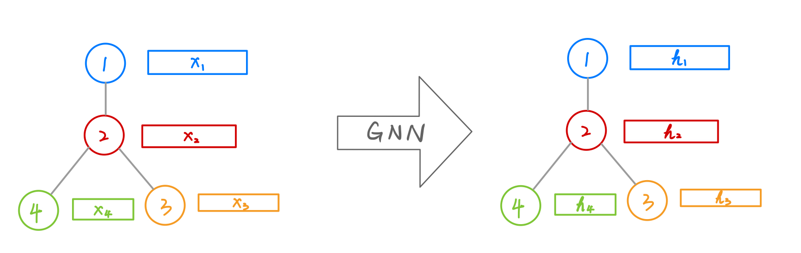

# Review: Graph Neural Networks

这篇文章Title是Graph Neural Networks: A Review of Methods and Applications，作者来自清华计算机系，暂时是Arxiv Preprint。

## 思路脉络

我只读了第二章前半段，对`GNN`和`GCN`有了一个idea上大概的把握。

`GNN`的思想是对一个图，每个节点学习一个state embedding，然后通过一个output函数可以将embedding映射为我们需要的值，比如label。一个示意图如下：

即从每个节点的输入特征$\mathbf{x}_v$和网络结构学到一个节点的隐含特征$\mathbf{h}_v$。`GNN`层最关键的是
1. (Aggregator) 如何从邻居处收集信息
2. (Updator) 如何基于收集的信息更新状态$\mathbf{h}_v$

最初的`GNN`的定义是：

$$
\begin{align}
\mathbf{h}_v &= f(\mathbf{x}_v, \mathbf{x}_{edge[v]}, \mathbf{h}_{neibor[v]}, \mathbf{x}_{neibor[v]})\\
\mathbf{o}_v&=g(\mathbf{h}_v, \mathbf{x}_v)
\end{align}
$$

这种最早的`GNN`要求$f$是压缩映射，$\mathbf{h}$定义为其不动点。梯度信息由$\mathbf{o}_v$和监督信息$\mathbf{t}_v$的损失给出。缺点是
1. 算不动点的开销大
2. 在迭代时每轮的参数是相同的（神经网络中每层的参数不同，用以提取不同层次的特征）
3. 迭代过程是Sequential操作，但是没有利用RNN的kernel，例如`GRU`或者`LSTM`
4. 边的状态没有考虑

`GCN`是在Aggregator上对`GNN`做出了修改，引入了“图卷积”的概念。图卷积其实就是对图的拉普拉斯矩阵$\mathbf{L}=\mathbf{I}-\mathbf{D}^{-1/2}\mathbf{AD}^{-1/2}$在谱空间里做放缩：

$$
\mathbf{g}_\theta\star \mathbf{x} = \mathbf{Ug}_\theta(\boldsymbol{\Lambda})\mathbf{U}^T\mathbf{x}
$$

对这里的谱分解利用Chebyshev多项式做$K$阶近似：

$$
\mathbf{g}_\theta\star \mathbf{x} \approx\sum_{k=0}^K\theta_k\mathbf{T}_k(\tilde{\mathbf{L}})\mathbf{x}
$$

其中$\mathbf{T}_k (\mathbf{x}) = 2\mathbf{x}\mathbf{T}_{k-1}(\mathbf{x})-\mathbf{T}_{k-2}(\mathbf{x})$是切比雪夫多项式，$\tilde{\mathbf{L}}=\frac{2}{\lambda_\max}\mathbf{L}-\mathbf{I}$。这样的近似的损失就是不如谱分解保留了全局的相似性信息，可以认为是$K$跳的信息传播距离。

在这个近似的基础上令$K=2$，并假设$\lambda_\max\approx 2$，有

$$
\mathbf{g}_\theta\star \mathbf{x} \approx \theta_0\mathbf{x}+\theta_1(\mathbf{L}-\mathbf{I})\mathbf{x}
$$

再假设$\theta_0 = -\theta_1=\theta$，有

$$
\mathbf{g}_\theta\star\mathbf{x}\approx\theta\left(\mathbf{I}+\mathbf{D}^{-1/2}\mathbf{AD}^{-1/2}\right)\mathbf{x}
$$

表示成矩阵形式即

$$
\mathbf{H} = \tilde{\mathbf{D}}^{-1/2}\tilde{\mathbf{A}}\tilde{\mathbf{D}}^{-1/2}\mathbf{X}\boldsymbol{\Theta}
$$

即在参数乘以特征的基础上再左乘一个类似拉普拉斯矩阵的项，以引入结构信息。