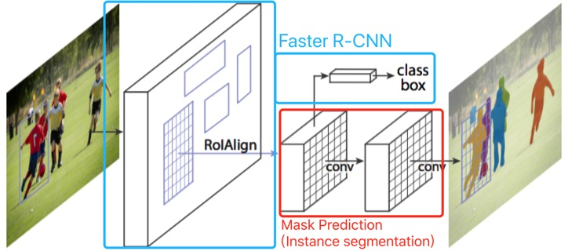

# Mask R-CNN

这篇文章是Kaiming He, Georgia Gkioxari, Piotr Dollar和Ross Girshick，来自Facebook AI Research（FAIR），发表在2017年的ICCV上。

## 思路脉络

`Mask R-CNN`让`Faster R-CNN`有了语义分割的能力，即不光画了一个box，还可以输出一个物体的mask，即这个物体精确的外形——精确到每个像素。延伸一下可以学到关键点预测等（人体姿势、人脸关键点等）。思路很直观，在`Faster R-CNN`的最后输出中加入一个mask预测通道，如下图：

这个通道是一个`FCN`，其实就是做了一个语义分割，不同的是对每个类都做预测一个mask，最后按照预测的类别选择输出对应的mask。

## 写作技巧

1. 介绍了一个新的问题以后，强调它和现有的问题不一样的地方，然后话锋一转：你以为很难，但是我们这个模型又简单又有效。
2. 当实验效果很好的时候，直接开一段，“不吹不擂”地说我们很牛逼（Without bells and whistles）。
3. 在审稿时可以加一句“我们会开源”。同行可能会很高兴。
