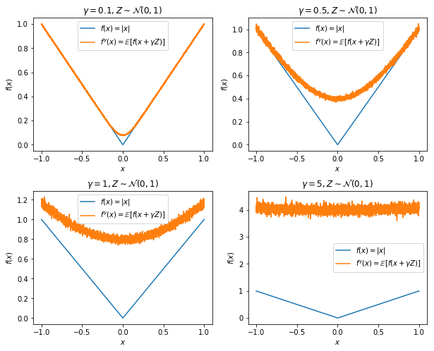

# Randomized smoothing for stochastic optimization

作者是JC Duchi, PL Bartlett, MJ Wainwright，来自伯克利EECS系和统计学系，发表在SIAM Journal on Optimization, 2012上。

## 思路脉络

这是一篇非常长的文章，我并没有时间详细读完，以后遇到相关的工作可能会再读。文章完整版本托管在[arXiv](https://arxiv.org/abs/1103.4296)上。

这篇文章是纯粹的优化理论文章，给出了**非光滑凸函数**的随机优化方法的收敛速度。收敛速度的界刻画了收敛速度和随机梯度的**方差**之间的关系，并且证明是最优的。方差项的出现意味着在理论上我们能给出这样一个问题的答案：如果我们每个梯度估计使用更多的采样点（即更小的方差），收敛速度在理论上能上升多少？

为了解决非光滑的问题，文章采用了随机扰动平滑（Randomized Perturbation Smoothing）对原非光滑的函数进行近似，记原函数为$$f(x)$$为$$L$$-Lipschitz连续，对$$\gamma>0$$，随机噪声$$\xi$$，有函数

$$
f_\gamma(x) \triangleq \mathbb{E}[f(x+\gamma\xi)]
$$

一定$$\frac{L}{\gamma}$$-Lipschitz光滑，意思是$$\gamma$$越小，近似效果越好，但是曲线的曲度就会越大。下面这个是近似的效果。

对光滑的函数来说，常见的一个bound是$$O(1/\sqrt{T})$$，没有涉及采样率。文章给出了一个error上界，其中一项是依赖于梯度估计误差$$e_t\triangleq\nabla f_{\gamma_t}(x_t)-g_t$$的方差。

这篇文章有完整的smoothing方面性质的证明，以后或许有用。
